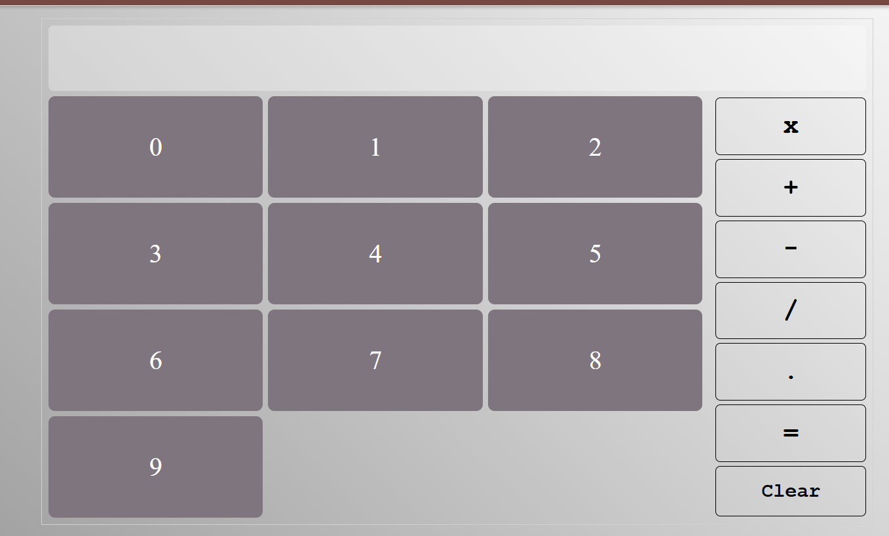

🧮 Responsive Calculator
A simple yet elegant responsive calculator built with HTML, CSS, and Vanilla JavaScript.

This project demonstrates DOM manipulation, event handling, and responsive design principles to create a fully functional calculator that works seamlessly across devices.

🚀 Features
- ➕ Basic arithmetic operations: addition, subtraction, multiplication, division
- 📱 Fully responsive layout (mobile, tablet, desktop)
- 🎨 Clean and modern UI with CSS styling
- ⚡ Built with Vanilla JavaScript (no frameworks)
- 🖱️ Interactive buttons with hover and click effects
- 🧩 DOM manipulation for dynamic updates

🖼️ Screenshots

🛠️ Installation & Usage
- Clone the repository:
git clone https://github.com/rasoulnasserifreelancer/calculator.git
- Navigate into the project folder:
cd calculator
- Open index.html in your browser.
That’s it — no build tools or dependencies required!

📚 Concepts Covered
- DOM selection and event listeners
- Updating the DOM dynamically
- Responsive design with CSS Flexbox/Grid
- Handling user input and edge cases

🌟 Live Demo
👉 View on Vercel
(recipe-app-api-nine.vercel.app)

📜 License
This project is licensed under the MIT License — free to use, modify, and distribute.

